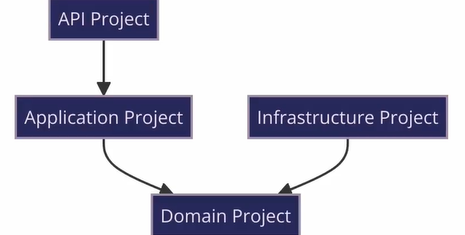

# DDD - Domain Driven Design

- DDD is a software development approach that focuses on the domain, the problem that the software is trying to solve, and the business logic that drives the problem. It's not an architecture.
  - The principles of DDD are:
    - Focus on the core domain and domain logic.
    - Base complex designs on models of the domain.
    - Collaborate with domain experts to improve the application model.
    - Speak a ubiquitous language within the team and with domain experts.
    - Develop a knowledge-rich model.
    - Continuously refine the model.
- Two concepts are important in DDD:
  - **Ambigous Language**: The language used by the team and the domain experts must be the same. This language is called the **Ubiquitous Language**.
  - **Bounded Context**: The domain is divided into multiple bounded contexts, each with its own Ubiquitous Language. The contexts are isolated from each other and communicate through well-defined interfaces.

## DDD on .NET

- 
- `API Project`: The entry point of the application. It contains the controllers and the startup class.
  - `Controllers`: The controllers that handle the HTTP requests and responses. Includes errors handling.
  - `Dependency injection`: The configuration of the dependency injection.
- `Application Project`: Contains the application services and business rules.
  - `Services`: The application services that contain the business logic.
  - `DTOs`: The Data Transfer Objects that are used to transfer data between the API and the services.
- `Infrastructure Project`: Contains the infrastructure services and the data access layer.
  - `Data`: Contains the data access layer.
- `Domain Project`: Contains the domain entities and the domain services.
  - `Entities`: The domain entities.
  - `Interfaces`: The interfaces that are used to communicate between the layers.

### DDD improved

- 
- `Communication Project`: Contains the request and response classes.
  - `Requests`: The request classes that are used to receive data from the API.
  - `Responses`: The response classes that are used to return data to the API.
- `Exception Project`: Contains the exceptions that are thrown by the application.
  - `Exceptions`: The exceptions that are thrown by the application. Including the custom exceptions.
  - `Validators`: The validators that are used to validate the requests.
  - `Translator`: Translates the API responses depending on the language of the user.
